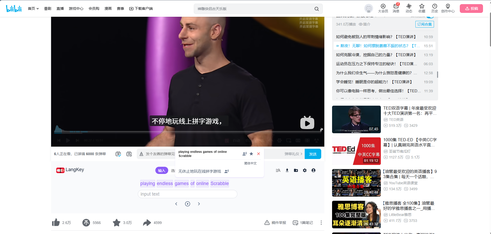

# 🌐 LangKey: AI Video Language Learning Assistant
### *让看视频学语言更轻松 | Make Language Learning Effortless*

  <a href="#-简体中文-chinese">简体中文</a> | 
  <a href="#-english-global">English</a> | 
  <a href="#-international-seo">日本語/한국어/Español/Deutsch</a>

  
  
  

---

## 📺 Demo Video / 演示视频

> 💡 **Tip**: Click the image above to watch the interactive demo!

---

## 🇨🇳 简体中文 (Chinese)

给大家推荐一款学习语言互动性的插件，支持 **YouTube** 和 **B站**。对学语言的朋友帮助很大，让看视频学语言更轻松、更有趣。

### ✨ 核心功能：5大互动模式
1.  **⌨️ 输入模式**：输入正确的一句话后，视频才会自动播放下一段。
2.  **🖱️ 选择模式**：通过选择正确的单词来练习语感。
3.  **✍️ 默写模式**：测试听力，根据声音写出完整句子。
4.  **🎙️ 语音输入**：实时练习口语和发音。
5.  **🤖 AI 填空**：根据难度自由设置，由 AI 生成智能填空练习。

**插件完全免费！** 请在各大插件市场搜索 **"LangKey"** 下载。

---

## 🇺🇸 English (Global)

Highly recommended: A powerful interactive language learning extension for **YouTube** and **Bilibili**. It transforms video streaming into an immersive classroom.

### ✨ 5 Interactive Modes
1.  **Typing Mode**: Master spelling—video syncs with your input.
2.  **Selection Mode**: Quick vocabulary recognition exercises.
3.  **Dictation Mode**: Intensive listening practice.
4.  **Voice Input**: Real-time pronunciation feedback.
5.  **AI Fill-in-the-Blank**: Smart, adaptive difficulty scaling.

---

## 📥 Download / 插件下载

| Browser | Store Link |
| :--- | :--- |
| **Microsoft Edge** | [👉 点击前往 Edge 商店](https://microsoftedge.microsoft.com/addons/detail/youtube%E6%B2%89%E6%B5%B8%E5%BC%8F%E5%AD%A6%E5%A4%96%E8%AF%AD%E5%8A%A9%E6%89%8B/pfamchnplpbecklooemkedlmccegkbkk) |
| **Google Chrome** | [👉 点击前往 Chrome 商店](https://chromewebstore.google.com/detail/langkey-ai-%E8%A7%86%E9%A2%91%E8%AF%AD%E8%A8%80%E5%AD%A6%E4%B9%A0%E5%8A%A9%E6%89%8B-youtu/chhjnodmnfbljoindmeeafjiepfjpamn) |
| **Mozilla Firefox** | [👉 点击前往 Firefox 商店](https://addons.mozilla.org/en-US/firefox/addon/langkey/) |

---

## 🌍 International (SEO)

<b>🇯🇵 日本語 / 🇰🇷 한국어 / 🇪🇸 Español / 🇩🇪 Deutsch</b>

### 日本語
YouTubeやB站で動画を楽しみながら学習！
1. タイピングモード 2. 選択モード 3. ディクテーション 4. 音声入力 5. AI穴埋め

### 한국어
유튜브와 비리비리를 통한 스마트한 언어 학습!
1. 타이핑 모드 2. 선택 모드 3. 받아쓰기 4. 음성 입력 5. AI 빈칸 채우기

### Español
¡Aprende idiomas de forma interactiva!
1. Modo Escritura 2. Modo Selección 3. Modo Dictado 4. Modo Voz 5. Relleno con IA

### Deutsch
Sprachen lernen mit YouTube-Videos!
1. Tipp-Modus 2. Auswahl-Modus 3. Diktat-Modus 4. Spracheingabe 5. KI-Lückentext

---

## 📸 Screenshots / 软件截图

---

Made with ❤️ for Language Learners. Search <b>"LangKey"</b> to start.
